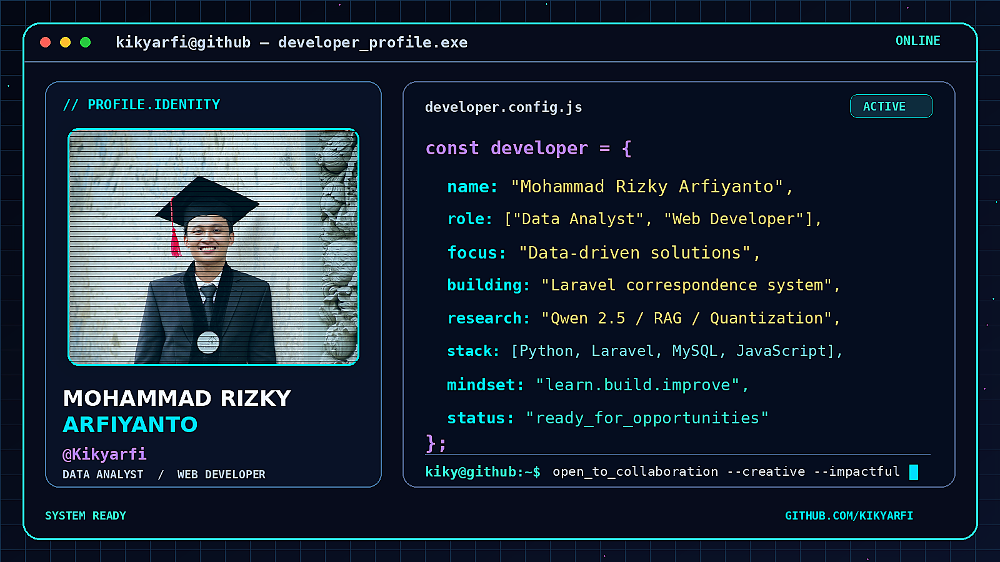

## About Me

I am **Mohammad Rizky Arfiyanto**, a **Data Analyst and Web Developer** who enjoys turning data into meaningful insights and building useful web applications.

- Currently developing a correspondence management system with **Laravel and MySQL**.
- Exploring **Retrieval-Augmented Generation, LLMs, and model quantization**.
- Interested in combining data, technology, and practical problem-solving.

## Featured Work

| Project | Description | Technologies |
|---|---|---|
| [Game Penalty Shoot](https://github.com/Kikyarfi/Game_PenaltyShoot) | Responsive browser-based penalty shootout game. | HTML, CSS, JavaScript |
| Correspondence Management System | Document and correspondence management application. | Laravel, PHP, MySQL |
| Qwen 2.5 RAG Research | Comparison of quantized Qwen models for PDF-based RAG. | Python, LangChain, Chroma, Ollama |

## Tech Stack

`Python` · `Pandas` · `NumPy` · `Jupyter` · `MySQL` · `Laravel` · `PHP` · `JavaScript` · `HTML` · `CSS` · `Git`

[**View My Repositories**](https://github.com/Kikyarfi?tab=repositories)

